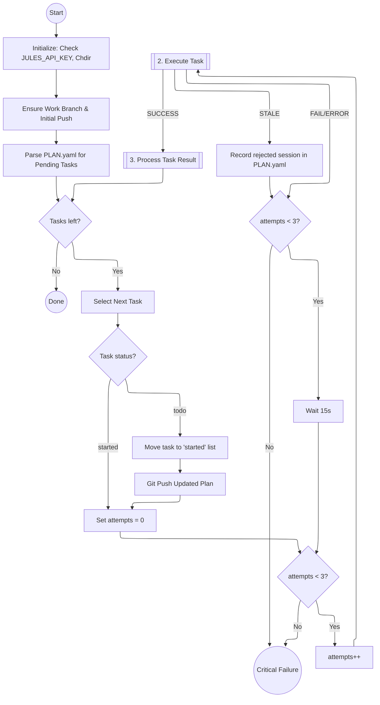
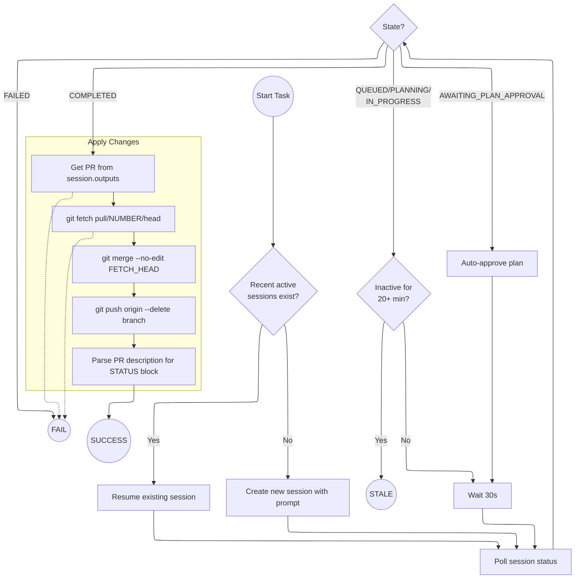
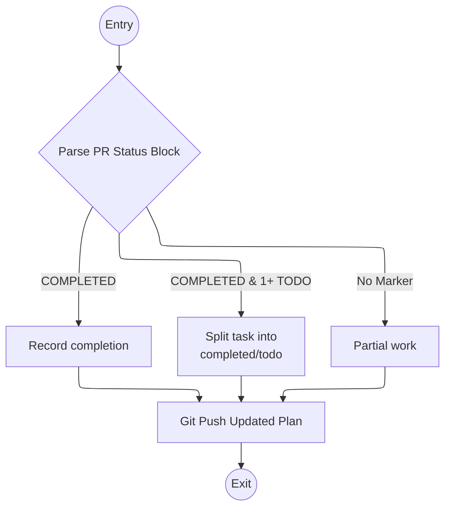

# Verne Durand: Autonomous Jules SDK Harness

If you're not using your 100 Jules sessions per day, you're leaving _money on the table._


This script automates the sequential execution of tasks using the Jules AI agent.

Jules is a bit flaky. Sessions hang. Sometimes Jules stops to ask if it's doing ok. The API is limited compared to the Web UI. `verne_durand` tries to work around these issues as best it can.

`verne_durand` is ALPHA. Trust it accordingly. When you encounter weirdness, please open an Issue.

### Key Features

- **API-Based**: Uses the [jules-agent-sdk](https://github.com/AsyncFuncAI/jules-agent-sdk-python) to communicate with the Jules AI agent.
- **`uv` Ready**: Includes inline dependency metadata for zero-setup execution.
- **Resilient**: Automatically resumes active sessions or retries failed tasks (but don't worry, not indefinitely).
- **Auto-Approval**: Detects when a plan requires approval and automatically approves it to maintain autonomy.
- **Git Integration**: Automatically manages branch creation, remote pushing, merging Jules' changes, and **cleaning up transient branches** after work is applied.

## Usage

1. Get your [Jules API key](https://jules.google.com/settings/api).
2. Optional (but recommended): Add an [AGENTS.md](https://agents.md) to the project. Have an LLM make it.
3. Add a checklist (e.g. PLAN.yaml) for Jules in your project. Again, I recommend having an LLM make it. It should look like:

```yaml
todo:
  - "Implement feature A"
  - "Fix bug B"
```

4. Run the harness:

```bash
export JULES_API_KEY="your-api-key" # Or set it in verne_durand's .env file
# If PLAN.yaml is in the project root:
uv run verne_durand.py --project /path/to/project --plan PLAN.yaml
```

## Demo

Copy [docs/demo.yaml](docs/demo.yaml) to an empty repository, and run the script!

## Flow Architecture

### 1. Main Control Loop



### 2. Task Execution Detail (run_jules_task)



### 3. Task Result Processing



## Prompt Template

See [prompt_template.txt](prompt_template.txt). By all means, edit it as you see fit.

## Status Monitoring

While Jules is working, Verne Durand displays a character every 30 seconds to indicate the current session state:

- `Q`: **Queued** - Jules is waiting for resources.
- `P`: **Planning** - Jules is analyzing the codebase and creating a plan.
- `W`: **Waiting for Approval** - Jules has a plan ready and is waiting for it to be approved (Verne tries to auto-approve).
- `U`: **User Feedback** - Jules is waiting for manual input from the user (via the Web UI).
- `.`: **In Progress** - Jules is in the `IN_PROGRESS` state, but hasn't created a new activity since the last poll.
- `,`: **Active Progress** - Jules is `IN_PROGRESS` and has created new activities (e.g., running commands, editing files) since the last poll.
- `Z`: **Paused** - The session has been manually or automatically paused.
- `F`: **Failed** - Jules encountered an error and couldn't continue.
- `C`: **Completed** - Jules has finished the task and created a Pull Request.
- `?`: **Unknown** - Transient API error or unknown state.

## Tools

- **`tools/session_info.py`**: Inspects detailed status of a Jules session.
