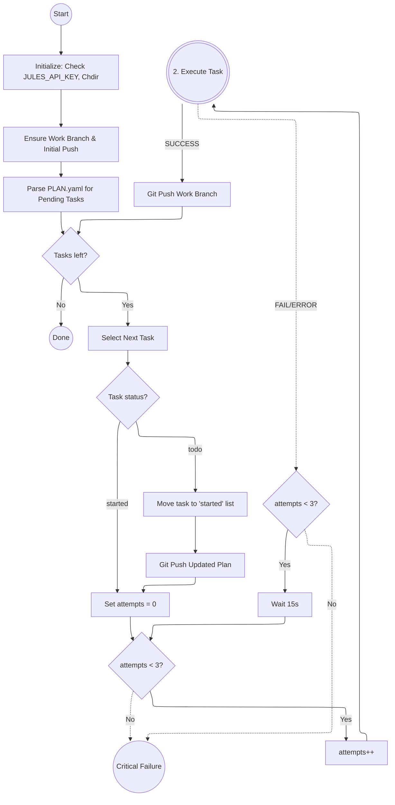
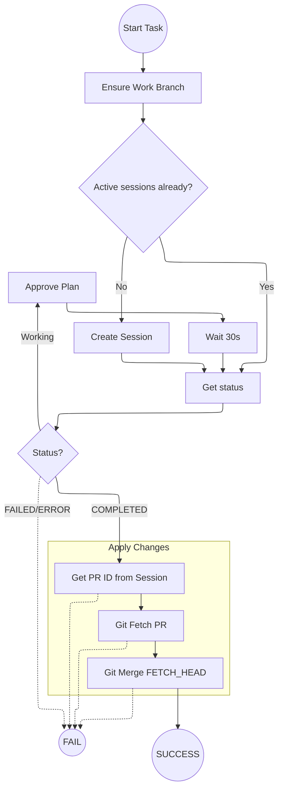

## Verne Durand: Autonomous Jules SDK Harness

This script automates the execution of multiple tasks using the Jules AI agent. It parses a YAML checklist (e.g., `PLAN.yaml`) and executes tasks in the `todo` and `started` lists sequentially.

### Key Features
- **SDK-Based**: Uses the official `jules-agent-sdk`, ensuring robust communication and automatic retries.
- **`uv` Ready**: Includes inline dependency metadata for zero-setup execution.
- **Resilient**: Automatically resumes active sessions or retries failed tasks (up to 3 times).
- **Auto-Approval**: Detects when a plan requires approval and automatically approves it to maintain autonomy.
- **Git Integration**: Automatically manages branch creation, remote pushing, and merging Jules' generated changes.

### TODO

* Parallel task execution

### Usage
Run the harness using `uv`. The plan file is a YAML file specific to the project you are working on, usually located at the root of that project.

```bash
export JULES_API_KEY="your-api-key"
# If PLAN.yaml is in the project root:
uv run verne_durand.py --plan PLAN.yaml --project /path/to/project
```

### Checklist Format (`PLAN.yaml`)
The checklist is a YAML file with the following structure:
```yaml
todo:
  - "Implement feature A"
  - "Fix bug B"
started: []
completed: []
```

### Flow Architecture

### 1. Main Orchestration Loop


### 2. Task Execution Detail (run_jules_task)


## The Name

If one person checks out _Anathem_ thanks to this silly name, it'll've been worth it.