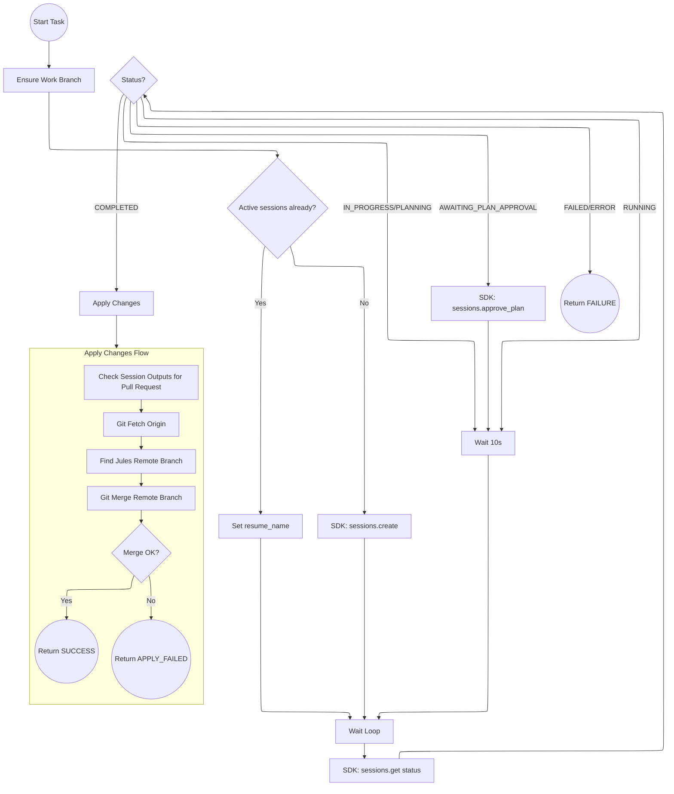

## Verne Durand: Autonomous Jules SDK Harness

This script automates the execution of multiple tasks using the Jules AI agent. It parses a markdown checklist (e.g., `PLAN.md`) and executes unchecked tasks sequentially.

### Key Features
- **SDK-Based**: Uses the official `jules-agent-sdk`, ensuring robust communication and automatic retries.
- **`uv` Ready**: Includes inline dependency metadata for zero-setup execution.
- **Resilient**: Automatically resumes active sessions or retries failed tasks (up to 3 times).
- **Auto-Approval**: Detects when a plan requires approval and automatically approves it to maintain autonomy.
- **Git Integration**: Automatically manages branch creation, remote pushing, and merging Jules' generated changes.

### TODO

* Show link to Jules session in the output
* Use YAML for checklist
* Simultaneous tasks

### Usage
Run the harness using `uv`:
```bash
export JULES_API_KEY="your-api-key"
uv run verne_durand.py --plan PLAN.md --project /path/to/project
```

### Flow Architecture

### 1. Main Orchestration Loop
```mermaid
---
config:
  layout: elk
---
flowchart TD
    Start((Start)) --> Init[Initialize: Check JULES_API_KEY, Chdir]
    Init --> Ensure[Ensure Work Branch & Initial Push]
    Ensure --> ParsePlan[Parse PLAN.md for Unchecked Tasks]
    ParsePlan --> HasTasks{Tasks left?}
    
    HasTasks -- No --> Done((Done))
    
    HasTasks -- Yes --> GetNextTask[Select Next Task]
    GetNextTask --> InitRetry[Set attempts = 0]
    InitRetry --> RetryLoop{attempts < 3?}
    
    RetryLoop -- No --> CritFail((Critical Failure))
    
    RetryLoop -- Yes --> IncAttempts[attempts++]
    
    IncAttempts --> Execution[[Execute Task (See Diagram 2)]]
    
    Execution -- SUCCESS --> Push[Git Push Work Branch]
    Push --> HasTasks
    
    Execution -- FAIL/ERROR --> CheckRetry{attempts < 3?}

    CheckRetry -- Yes --> RetryWait[Wait 15s]
    RetryWait --> RetryLoop

    CheckRetry -- No --> RetryLoop
```

### 2. Task Execution Detail (run_jules_task)

