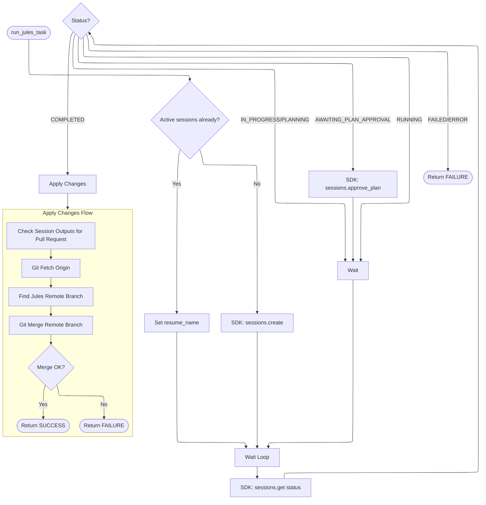

## Verne Durand: Autonomous Jules SDK Harness

This script automates the execution of multiple tasks using the Jules AI agent. It parses a checklist (Markdown or YAML) and executes pending tasks sequentially.

### Key Features
- **SDK-Based**: Uses the official `jules-agent-sdk`, ensuring robust communication and automatic retries.
- **`uv` Ready**: Includes inline dependency metadata for zero-setup execution.
- **Flexible Plans**: Supports both Markdown (`PLAN.md`) and YAML (`PLAN.yaml`) formats.
- **Resilient**: Automatically resumes active sessions or retries failed tasks (up to 3 times).
- **Auto-Approval**: Detects when a plan requires approval and automatically approves it to maintain autonomy.
- **Git Integration**: Automatically manages branch creation, remote pushing, and merging Jules' generated changes.
- **Configurable**: Supports configuration via environment variables.

### TODO

* Simultaneous tasks
* See `docs/IMPROVEMENTS.md` for more ideas.

### Usage
Run the harness using `uv`:

```bash
export JULES_API_KEY="your-api-key"

# Using Markdown Plan
uv run verne_durand.py --plan PLAN.md --project /path/to/project

# Using YAML Plan
uv run verne_durand.py --plan PLAN.yaml --project /path/to/project
```

#### Configuration
You can configure behavior via environment variables:
*   `VERNE_TIMEOUT_MIN`: Max time per task (default: 1440).
*   `VERNE_MAX_RETRIES`: Max retries per task (default: 3).
*   `VERNE_WORK_BRANCH`: Git branch to work on (default: `verne_durand`).

### Flow Architecture

#### High-Level Task Execution
```mermaid
---
config:
  layout: elk
---
flowchart TD
    Start((Start)) --> Init[Initialize: Check JULES_API_KEY, Chdir]
    Init --> ParsePlan[Parse Plan (MD/YAML)]
    ParsePlan --> HasTasks{Tasks left?}
    
    HasTasks -- No --> Done((Done))
    
    HasTasks -- Yes --> GetNextTask[Select Next Task]
    GetNextTask --> InitRetry[Set attempts = 0]
    InitRetry --> RetryLoop{attempts < 3?}
    
    RetryLoop -- No --> CritFail((Critical Failure))
    
    RetryLoop -- Yes --> IncAttempts[attempts++]
    
    IncAttempts --> RunTask[Run Jules Task]
    RunTask --> Result{Result?}

    Result -- SUCCESS --> Push[Git Push Work Branch]
    Push --> HasTasks

    Result -- FAILURE --> RetryWait[Wait 10s]
    RetryWait --> RetryLoop
```

#### Jules Session Logic

