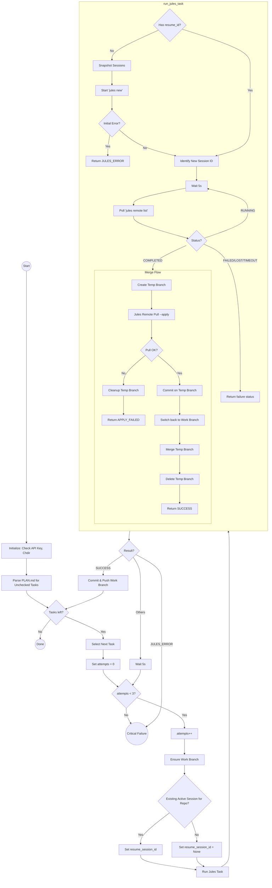

```mermaid
flowchart TD
    Start((Start)) --> Init[Initialize: Check API Key, Chdir]
    Init --> ParsePlan[Parse PLAN.md for Unchecked Tasks]
    ParsePlan --> HasTasks{Tasks left?}
    
    HasTasks -- No --> Done((Done))
    
    HasTasks -- Yes --> GetNextTask[Select Next Task]
    GetNextTask --> InitRetry[Set attempts = 0]
    InitRetry --> RetryLoop{attempts < 3?}
    
    RetryLoop -- No --> CritFail((Critical Failure))
    
    RetryLoop -- Yes --> IncAttempts[attempts++]
    IncAttempts --> EnsureBranch[Ensure Work Branch]
    EnsureBranch --> CheckExisting{Existing Active Session for Repo?}
    
    CheckExisting -- Yes --> UseExisting[Set resume_session_id]
    CheckExisting -- No --> ClearResume[Set resume_session_id = None]
    
    UseExisting --> TaskStart[Run Jules Task]
    ClearResume --> TaskStart
    
    subgraph Execution [run_jules_task]
        direction TB
        HasResume{Has resume_id?}
        HasResume -- No --> Snapshot[Snapshot Sessions]
        Snapshot --> NewSession[Start 'jules new']
        NewSession --> IsError{Initial Error?}
        IsError -- Yes --> ReturnFatal[Return JULES_ERROR]
        IsError -- No --> Identify[Identify New Session ID]
        
        HasResume -- Yes --> Identify
        
        Identify --> Wait5[Wait 5s]
        Wait5 --> Poll[Poll 'jules remote list']
        Poll --> Status{Status?}
        Status -- RUNNING --> Wait5
        Status -- FAILED/LOST/TIMEOUT --> ReturnFail[Return failure status]
        Status -- COMPLETED --> MergeWorkflow
        
        subgraph MergeWorkflow [Merge Flow]
            direction TB
            TempBranch[Create Temp Branch] --> JulesPull[Jules Remote Pull --apply]
            JulesPull --> PullSuccess{Pull OK?}
            PullSuccess -- No --> Recover[Cleanup Temp Branch]
            Recover --> ReturnApplyFail[Return APPLY_FAILED]
            PullSuccess -- Yes --> CommitTemp[Commit on Temp Branch]
            CommitTemp --> SwitchBack[Switch back to Work Branch]
            SwitchBack --> Merge[Merge Temp Branch]
            Merge --> DelTemp[Delete Temp Branch]
            DelTemp --> ReturnSuccess[Return SUCCESS]
        end
    end
    
    TaskStart --> Execution
    Execution --> Result{Result?}
    
    Result -- SUCCESS --> Push[Commit & Push Work Branch]
    Push --> HasTasks
    
    Result -- JULES_ERROR --> CritFail
    
    Result -- Others --> RetryWait[Wait 5s]
    RetryWait --> RetryLoop
```