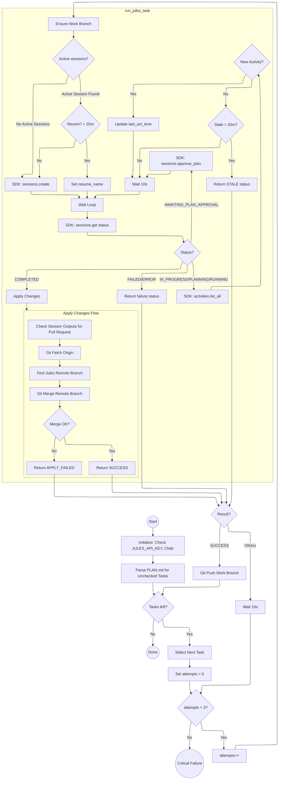

## Ralph Wiggum: Autonomous Jules SDK Harness

This script automates the execution of multiple tasks using the Jules AI agent. It parses a markdown checklist (e.g., `PLAN.md`) and executes unchecked tasks sequentially.

### Key Features
- **SDK-Based**: Uses the official `jules-agent-sdk`, ensuring robust communication and automatic retries.
- **`uv` Ready**: Includes inline dependency metadata for zero-setup execution.
- **Resilient**: Automatically resumes active sessions or retries failed tasks (up to 3 times).
- **Auto-Approval**: Detects when a plan requires approval and automatically approves it to maintain autonomy.
- **Git Integration**: Automatically manages branch creation, remote pushing, and merging Jules' generated changes.

### Usage
Run the harness using `uv`:
```bash
export JULES_API_KEY="your-api-key"
uv run ralph-wiggum-jules.py --plan PLAN.md --project /path/to/project
```

### Flow Architecture
The diagram above illustrates the orchestration logic between the local repository and the Jules autonomous agent, now streamlined through the Python SDK.